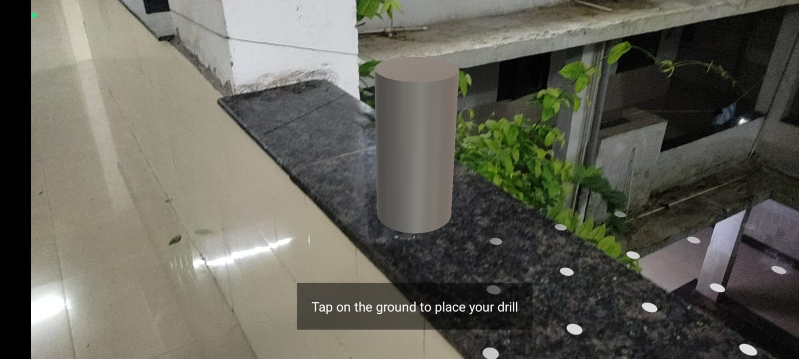
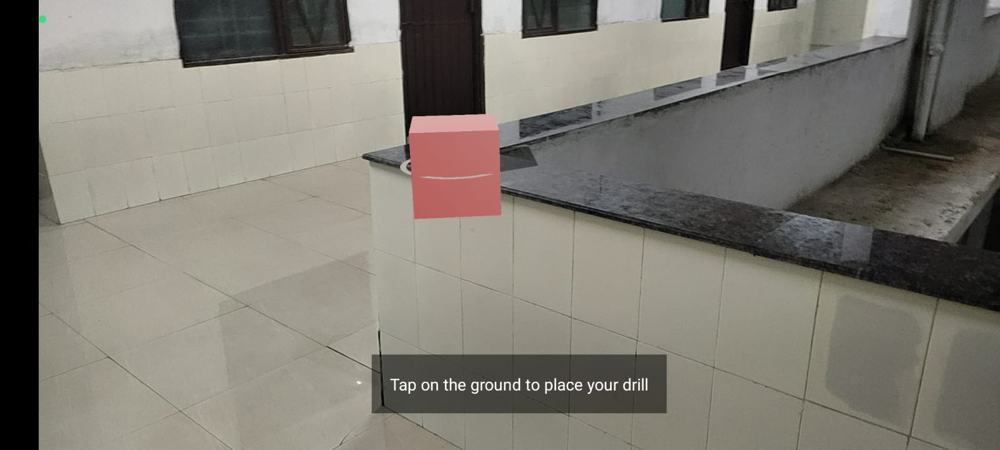
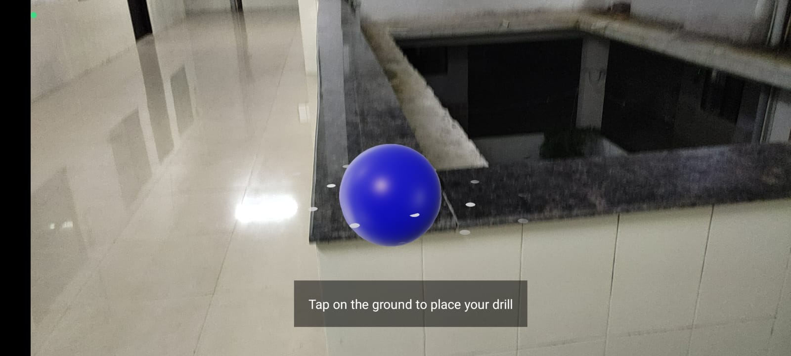

# AR Drill Placement App

An Android AR application that lets users select and place virtual drill markers in augmented reality space.

## Features
- Drill selection from 3 options
- AR plane detection
- Tap-to-place functionality
- Clean Material Design UI

## Screenshots
<div align="center">
  
   
  
</div>

## APK Download
Get the latest version:
- [Download APK](app/release/app-debug.apk) (Direct)

**Requirements:**
- Android 7.0+
- ARCore supported device
- Camera permission

## How to Use
1. Select a drill from the list
2. View drill details
3. Tap "Start AR" button
4. Point camera at flat surface
5. Tap to place drill marker

## Development Setup
1. Clone repository:
   ```bash
   git clone https://github.com/yourusername/ar-drill-app.git
